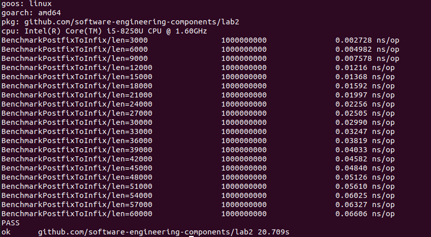
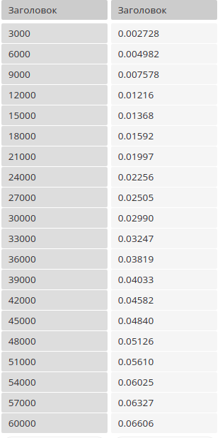
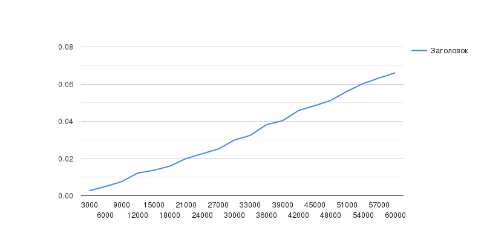
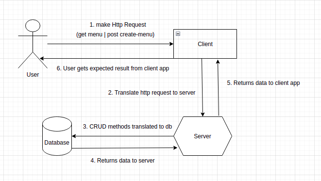
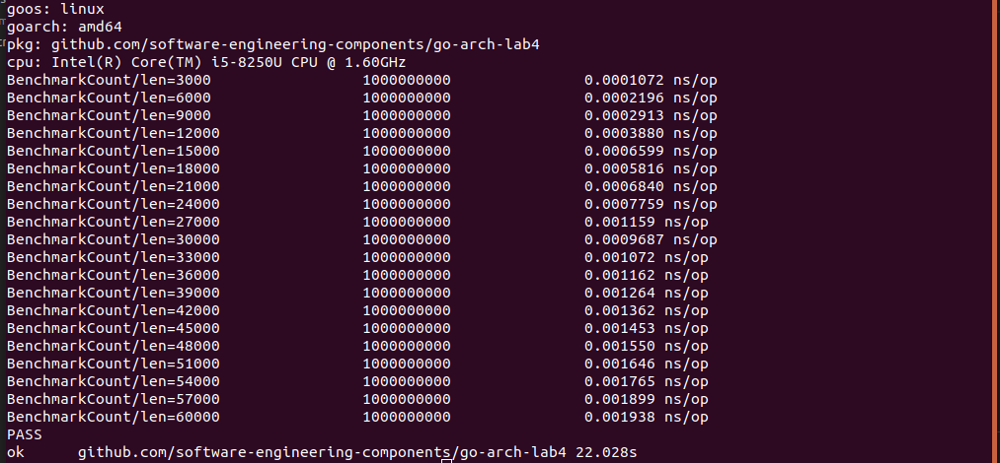
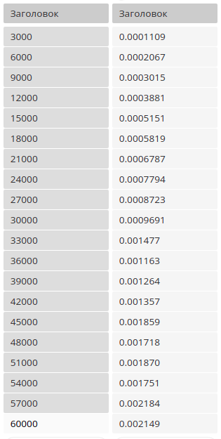
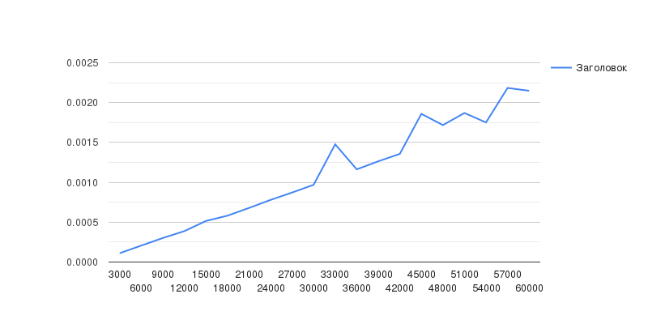
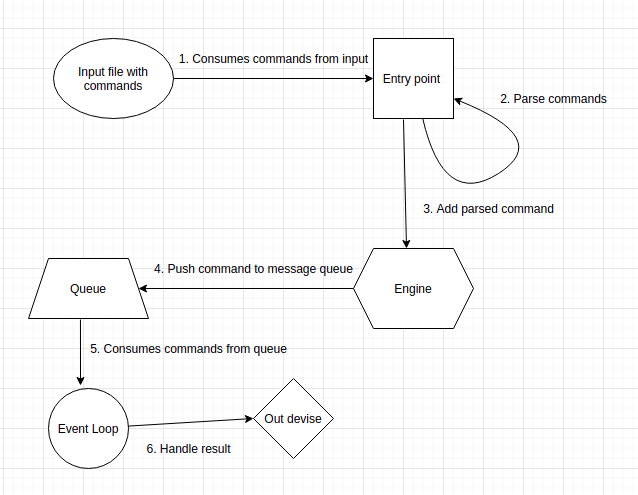

# go-rgr

Golang RGR Work

## Part1: Chart, data and code from Lab 2
### Bench testing


### Bench input data


### Bench chart


### Code
```
package lab2

import (
	"fmt"
	"testing"
)

var baseInputData string = "ab+c*ef+g/+"
var cntRes string
var err error

func BenchmarkPostfixToInfix(b *testing.B) {
	const baseLength = 3000

	for i := 0; i < 20; i++ {
		input := baseInputData
		num := baseLength * (i + 1)

		for j := 0; j < num; j++ {

			input = input + baseInputData
		}

		b.Run(fmt.Sprintf("len=%d", num), func(b *testing.B) {
			cntRes, err = postfixToInfix(input)
		})
	}
}
```

## Part2: Communication Diagram From Lab 3


## Part3: Chart, data and code from Lab 4
### Bench testing


### Bench input data


### Bench chart


### Event Loop Diagram


### Code
```
package main

import (
	"fmt"
	"testing"

	"github.com/software-engineering-components/go-arch-lab4/commands"
	"github.com/software-engineering-components/go-arch-lab4/engine"
)

var data = "test benchmark programm"
var cntRes engine.Command

func BenchmarkCount(b *testing.B) {
	const baseLen = 3000

	for i := 0; i < 20; i++ {
		input := data
		l := baseLen * (i + 1)

		for j := 0; j < l; j++ {
			input = input + "somerandomlineinput"
		}

		b.Run(fmt.Sprintf("len=%d", l), func(b *testing.B) {
			cntRes = commands.Parse(input)
		})
	}
}
```
